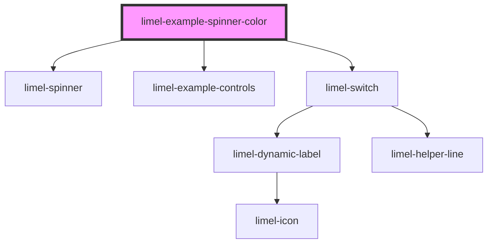

<!-- Auto Generated Below -->

## Overview

With custom colors
The `limel-spinner` is designed to cycle through ten colors which are all
from Lime Technologies' brand colors.

It is of course possible to override these colors.

## Dependencies

### Depends on

- [limel-spinner](..)
- [limel-example-controls](../../../examples)
- [limel-switch](../../switch)

### Graph

----------------------------------------------

*Built with [StencilJS](https://stenciljs.com/)*
