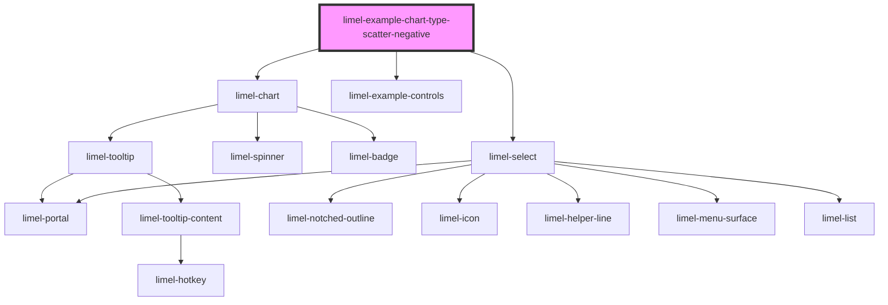

<!-- Auto Generated Below -->

## Overview

Scatter chart with negative values
Because a scatter chart has two value axes, either of them can carry negative
values — unlike single-axis charts, where only the value axis can. When the
data spans negative and positive on both axes, the chart draws a zero line on
each axis and places points in the correct quadrant relative to the origin.

Switching the `orientation` still transposes the whole plot, zero lines and
negative ranges included.

## Dependencies

### Depends on

- [limel-chart](..)
- [limel-example-controls](../../../examples)
- [limel-select](../../select)

### Graph

----------------------------------------------

*Built with [StencilJS](https://stenciljs.com/)*
