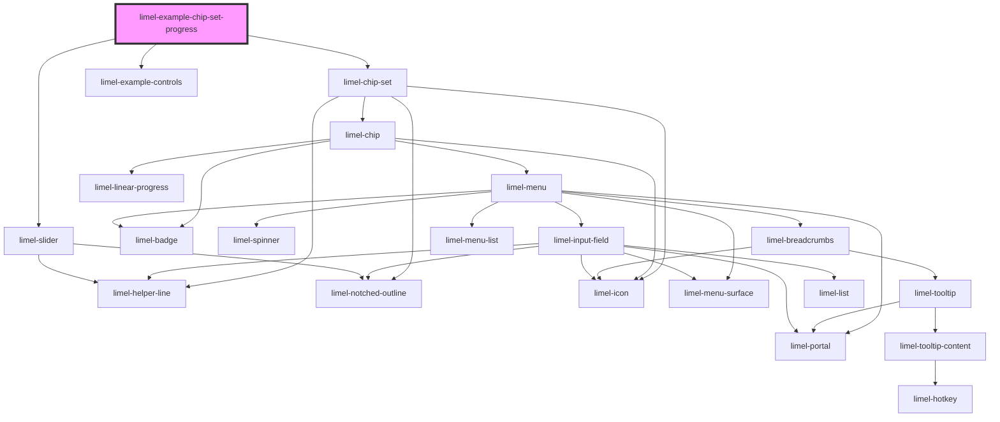

<!-- Auto Generated Below -->

## Overview

Progress on a chip

A chip in the set can show a determinate progress bar by setting `progress`
— a number between `0` and `100` — on the chip. This is useful for
reflecting an ongoing process on a specific chip, such as an upload.

For an indeterminate indicator, set `loading` on the chip instead.

## Dependencies

### Depends on

- [limel-chip-set](..)
- [limel-example-controls](../../../examples)
- [limel-slider](../../slider)

### Graph

----------------------------------------------

*Built with [StencilJS](https://stenciljs.com/)*
