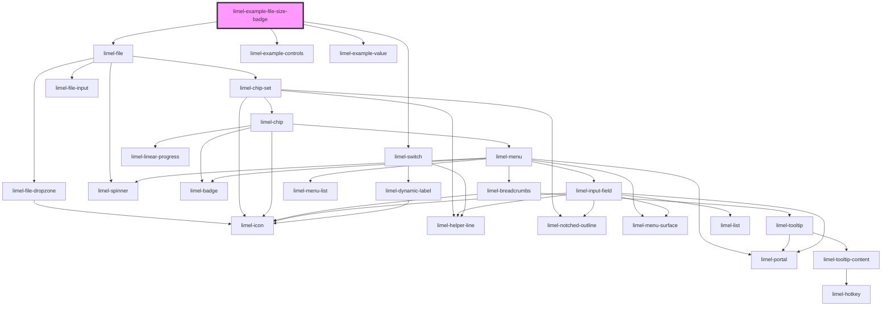

<!-- Auto Generated Below -->

## Overview

File size badge
When the size of the selected file is known, `limel-file` displays it as a
badge on the chip, giving end-users a quick sense of how large the file is.

The size is picked up automatically when a user chooses a file from their
device. When a file is provided programmatically, for example when loaded
from a server, the badge is only shown if the `size` property (in bytes) is
set on the `FileInfo` object. Toggle the switch below to see the difference.

## Dependencies

### Depends on

- [limel-file](..)
- [limel-example-controls](../../../examples)
- [limel-switch](../../switch)
- [limel-example-value](../../../examples)

### Graph

----------------------------------------------

*Built with [StencilJS](https://stenciljs.com/)*
