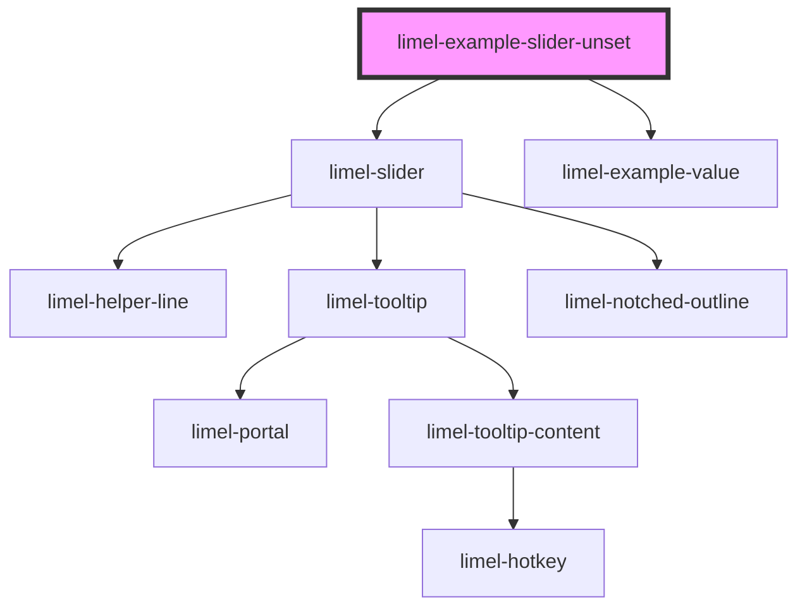

<!-- Auto Generated Below -->

## Overview

Unsetting the value

This slider is initialized *unset*, which means its `value` is `NaN`.
Therefore the thumb rests in the middle, and the value indicator shows a `?`.
Assistive technologies announce the value as "Value not set".

As soon as the user drags the thumb (or nudges it with the arrow keys),
the slider becomes set and the trailing **clear** button becomes active.
Pressing it unsets the slider again, emitting `NaN` on the `change` event.

A `required` slider does not offer the clear button — a required value
cannot be unset — but it can still start unset to prompt a first choice.

To unset the slider programmatically, set its `value` to `NaN` (or any
other non-finite value, such as `undefined`).

## Dependencies

### Depends on

- [limel-slider](..)
- [limel-example-value](../../../examples)

### Graph

----------------------------------------------

*Built with [StencilJS](https://stenciljs.com/)*
