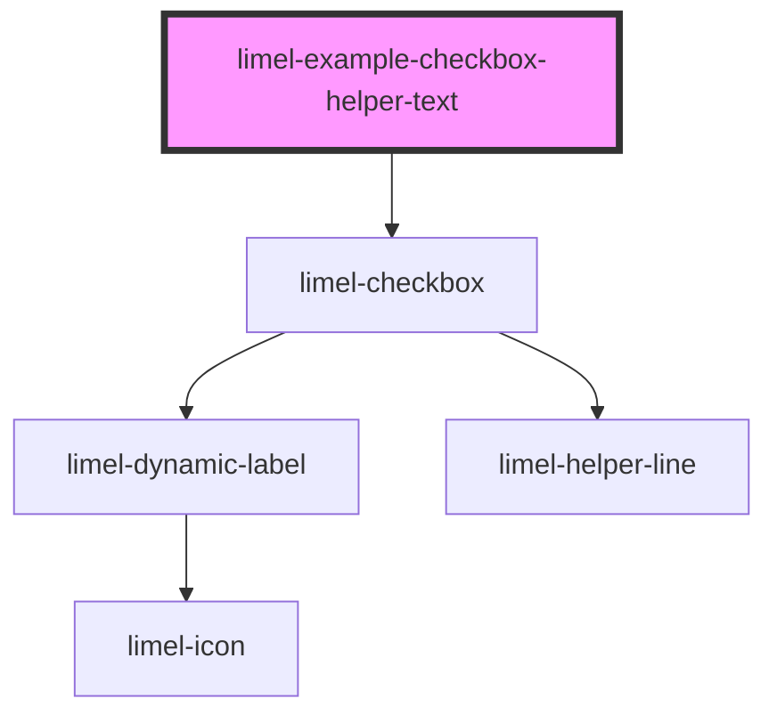

<!-- Auto Generated Below -->

## Overview

With `helperText`

Checkboxes can have a helper text, which is useful when providing additional information
can clarify functionality of the checkbox for the user.

The helper text is displayed when user hovers the checkbox, or focuses on it using keyboard
navigation. However, on touchscreen devices, the helper text is always displayed.

## Dependencies

### Depends on

- [limel-checkbox](..)

### Graph

----------------------------------------------

*Built with [StencilJS](https://stenciljs.com/)*
