<!-- Auto Generated Below -->

## Properties

| Property               | Attribute                | Description                                                                                                                                                                                                                                                                                                                     | Type                                                                         | Default      |
| ---------------------- | ------------------------ | ------------------------------------------------------------------------------------------------------------------------------------------------------------------------------------------------------------------------------------------------------------------------------------------------------------------------------- | ---------------------------------------------------------------------------- | ------------ |
| `disabled`             | `disabled`               | Set to `true` to disable the field. Use `disabled` to indicate that the field can normally be interacted with, but is currently disabled. This tells the user that if certain requirements are met, the field may become enabled again.                                                                                         | `boolean`                                                                    | `false`      |
| `format`               | `format`                 | Format to display the selected date in.                                                                                                                                                                                                                                                                                         | `string`                                                                     | `undefined`  |
| `formatter`            | --                       | Custom formatting function. Will be used for date formatting.  :::note overrides `format` and `language` :::                                                                                                                                                                                                                    | `(date: Date) => string`                                                     | `undefined`  |
| `helperText`           | `helper-text`            | Optional helper text to display below the input field when it has focus.  Overridden by `invalidFormatMessage` while the typed text doesn't parse as a valid date.                                                                                                                                                              | `string`                                                                     | `undefined`  |
| `invalid`              | `invalid`                | Set to `true` to indicate that the current value of the date picker is invalid.  Note: this is separate from — and unaffected by — the component's own detection of unparseable typed text. Use this prop for your own business rules (e.g. `required`); the component flags format errors on its own regardless of this value. | `boolean`                                                                    | `false`      |
| `invalidFormatMessage` | `invalid-format-message` | Message shown instead of `helperText` when the text currently typed into the field cannot be parsed as a date. If omitted, a generic message naming the expected format is shown.                                                                                                                                               | `string`                                                                     | `undefined`  |
| `label`                | `label`                  | Text to display next to the date picker                                                                                                                                                                                                                                                                                         | `string`                                                                     | `undefined`  |
| `language`             | `language`               | Defines the localisation for translations and date formatting. Property `format` customizes the localized date format.                                                                                                                                                                                                          | `"da" \| "de" \| "en" \| "fi" \| "fr" \| "nb" \| "nl" \| "no" \| "sv"`       | `'en'`       |
| `placeholder`          | `placeholder`            | The placeholder text shown inside the input field, when the field is focused and empty.  Defaults to the expected date format (e.g. `MM/DD/YYYY`), so a consumer that sets `format` gets a hint for what to type for free.                                                                                                      | `string`                                                                     | `undefined`  |
| `readonly`             | `readonly`               | Set to `true` to make the field read-only. Use `readonly` when the field is only there to present the data it holds, and will not become possible for the current user to edit.                                                                                                                                                 | `boolean`                                                                    | `false`      |
| `required`             | `required`               | Set to `true` to indicate that the field is required.                                                                                                                                                                                                                                                                           | `boolean`                                                                    | `false`      |
| `type`                 | `type`                   | Type of date picker.                                                                                                                                                                                                                                                                                                            | `"date" \| "datetime" \| "month" \| "quarter" \| "time" \| "week" \| "year"` | `'datetime'` |
| `value`                | --                       | The value of the field.                                                                                                                                                                                                                                                                                                         | `Date`                                                                       | `undefined`  |

## Events

| Event    | Description                                                                                                                                                                                                                                                                                 | Type                |
| -------- | ------------------------------------------------------------------------------------------------------------------------------------------------------------------------------------------------------------------------------------------------------------------------------------------- | ------------------- |
| `change` | Emitted when the date picker value is changed, whether by typing a valid date and committing it, picking a day in the calendar, choosing "Today", or clearing the field. This is the single source of truth for value changes — it always fires, regardless of which interaction caused it. | `CustomEvent<Date>` |

## Dependencies

### Used by

 - [limel-example-date-picker-composite](examples)
 - [limel-example-date-picker-custom-formatter](examples)
 - [limel-example-date-picker-date](examples)
 - [limel-example-date-picker-datetime](examples)
 - [limel-example-date-picker-formatted](examples)
 - [limel-example-date-picker-month](examples)
 - [limel-example-date-picker-programmatic-change](examples)
 - [limel-example-date-picker-quarter](examples)
 - [limel-example-date-picker-time](examples)
 - [limel-example-date-picker-typed-input](examples)
 - [limel-example-date-picker-week](examples)
 - [limel-example-date-picker-year](examples)

### Depends on

- [limel-input-field](../input-field)
- [limel-portal](../portal)
- [limel-flatpickr-adapter](flatpickr-adapter)

### Graph

```mermaid
graph TD;
  limel-date-picker --> limel-input-field
  limel-date-picker --> limel-portal
  limel-date-picker --> limel-flatpickr-adapter
  limel-input-field --> limel-helper-line
  limel-input-field --> limel-icon
  limel-input-field --> limel-portal
  limel-input-field --> limel-menu-surface
  limel-input-field --> limel-list
  limel-input-field --> limel-notched-outline
  limel-example-date-picker-composite --> limel-date-picker
  limel-example-date-picker-custom-formatter --> limel-date-picker
  limel-example-date-picker-date --> limel-date-picker
  limel-example-date-picker-datetime --> limel-date-picker
  limel-example-date-picker-formatted --> limel-date-picker
  limel-example-date-picker-month --> limel-date-picker
  limel-example-date-picker-programmatic-change --> limel-date-picker
  limel-example-date-picker-quarter --> limel-date-picker
  limel-example-date-picker-time --> limel-date-picker
  limel-example-date-picker-typed-input --> limel-date-picker
  limel-example-date-picker-week --> limel-date-picker
  limel-example-date-picker-year --> limel-date-picker
  style limel-date-picker fill:#f9f,stroke:#333,stroke-width:4px
```

----------------------------------------------

*Built with [StencilJS](https://stenciljs.com/)*
