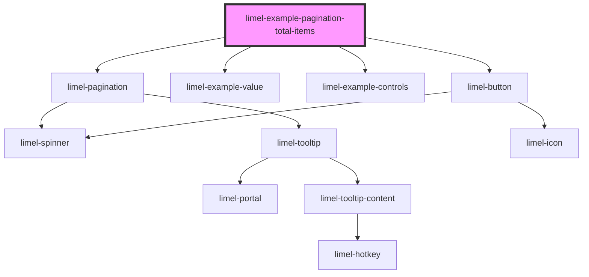

<!-- Auto Generated Below -->

## Overview

Total items

`totalItems` is how many items there are in total, across every page. It is
the only number the component needs to know how far the set goes.

Some apps fetch the items first and the total count a moment later, so that
the list appears sooner. If that is you, set `totalItems` to `null` until the
count turns up.

This example pretends to be such an app. Press the button and watch the order
things happen in: the items come back first, and the count a moment later.
While the count is missing the component keeps the pages it already knew
about, so nothing jumps around and you stay on the page you were on.

Going to another page only fetches the items. The count is still good, so the
page numbers do not flicker.

## Dependencies

### Depends on

- [limel-pagination](..)
- [limel-example-value](../../../examples)
- [limel-example-controls](../../../examples)
- [limel-button](../../button)

### Graph

----------------------------------------------

*Built with [StencilJS](https://stenciljs.com/)*
