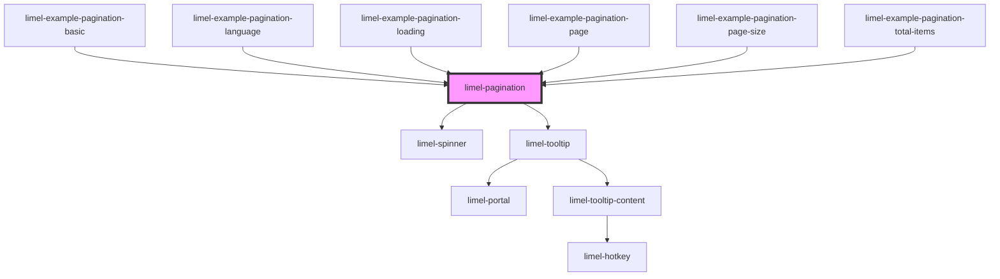

<!-- Auto Generated Below -->

## Overview

Pagination reports where the user is in a set of results, and allows them
to move somewhere else in it.

This component does not load anything on its own.
As a consumer, you give it a page and a total, and it emits the page
the user asked for — together with the `offset` and `limit` that page needs —
leaving the consumer to decide what that means.

:::note
Pagination does not decide how many items fit on a page. That is `pageSize`,
and it is yours to set, or a setting you let your users pick, next to your
other settings.
:::

Knowing where you are matters as much as being able to move. A page number
and a total tell people how much there is and how far into it they have got,
and hovering a page shows exactly which items it holds. A "load more" button
tells them none of that: there is no way to picture the set, or to know
whether pressing it again brings ten more items or ten thousand.

The component always renders, even when everything fits on one page and
there is nowhere to go. Hiding itself would move whatever sits below it at
the moment a filter happens to narrow the results, and the consumer could
not prevent that. Deciding not to render a pagination at all is a decision
only the consumer can make, so it is left to them.

Page 1 and the last page are always shown, so both ends of the list are one
click away. That is why there are no separate first and last buttons: the
numbers already do that job, and they say where they take you. When there are
more pages than fit, the ones left out are replaced by a `···`.

## Properties

| Property     | Attribute     | Description                                                                                                                                                                               | Type                                                                   | Default |
| ------------ | ------------- | ----------------------------------------------------------------------------------------------------------------------------------------------------------------------------------------- | ---------------------------------------------------------------------- | ------- |
| `language`   | `language`    | The language used for the labels and the tooltips, and for the way numbers are written.                                                                                                   | `"da" \| "de" \| "en" \| "fi" \| "fr" \| "nb" \| "nl" \| "no" \| "sv"` | `'en'`  |
| `loading`    | `loading`     | Set this to `true` while you are fetching a page.                                                                                                                                         | `boolean`                                                              | `false` |
| `page`       | `page`        | Which page to show when the component loads. The first page is `1`, not `0`.                                                                                                              | `number`                                                               | `1`     |
| `pageSize`   | `page-size`   | Number of items that fit on one page. Together with `totalItems`, used by the component to calculate the total number of pages.                                                           | `number`                                                               | `100`   |
| `totalItems` | `total-items` | How many items there are in total, across every page. `null` means the count has not arrived yet. Together with `pageSize`, used by the component to calculate the total number of pages. | `number`                                                               | `null`  |

## Events

| Event      | Description                                                                                                                                                                                                                                                                    | Type                         |
| ---------- | ------------------------------------------------------------------------------------------------------------------------------------------------------------------------------------------------------------------------------------------------------------------------------ | ---------------------------- |
| `goToPage` | Asks for a page to be loaded, and says which items it holds.  Emitted when the user picks a page, and when the component has to move them off one that no longer exists. A page you set yourself is not emitted back at you, and neither is a click on the page already shown. | `CustomEvent<GoToPageEvent>` |

## Dependencies

### Used by

 - [limel-example-pagination-basic](examples)
 - [limel-example-pagination-language](examples)
 - [limel-example-pagination-loading](examples)
 - [limel-example-pagination-page](examples)
 - [limel-example-pagination-page-size](examples)
 - [limel-example-pagination-total-items](examples)

### Depends on

- [limel-spinner](../spinner)
- [limel-tooltip](../tooltip)

### Graph

----------------------------------------------

*Built with [StencilJS](https://stenciljs.com/)*
