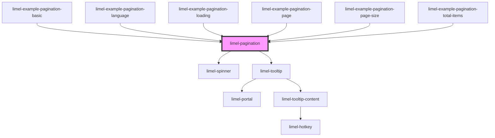

<!-- Auto Generated Below -->

## Overview

Pagination reports where the user is in a set of results, and allows them
to move somewhere else in it.

This component does not load anything on its own.
As a consumer, you give it a page and a total, and it emits the page
the user asked for — together with the `offset` and `limit` that page needs —
leaving the consumer to decide what that means.

:::note
Pagination does not decide how many items fit on a page. That is `pageSize`,
and it is yours to set, or a setting you let your users pick, next to your
other settings.
:::

Knowing where you are matters as much as being able to move. A page number
and a total tell people how much there is and how far into it they have got,
and hovering a page shows exactly which items it holds. A "load more" button
tells them none of that: there is no way to picture the set, or to know
whether pressing it again brings ten more items or ten thousand.

The component always renders, even when everything fits on one page and
there is nowhere to go. Hiding itself would move whatever sits below it at
the moment a filter happens to narrow the results, and the consumer could
not prevent that. Deciding not to render a pagination at all is a decision
only the consumer can make, so it is left to them.

Page 1 and the last page are always shown, so both ends of the list are one
click away. That is why there are no separate first and last buttons: the
numbers already do that job, and they say where they take you. When there are
more pages than fit, the ones left out are replaced by a `…`.

## Properties

| Property     | Attribute     | Description                                                                                                                                                                                                                                                                                                                                                                                                                                                                                                                                     | Type                                                                   | Default |
| ------------ | ------------- | ----------------------------------------------------------------------------------------------------------------------------------------------------------------------------------------------------------------------------------------------------------------------------------------------------------------------------------------------------------------------------------------------------------------------------------------------------------------------------------------------------------------------------------------------- | ---------------------------------------------------------------------- | ------- |
| `language`   | `language`    | The language used for the labels a screen reader reads out, and for the text in the tooltips. It also decides how numbers are written, since `9 840` and `9,840` are the same number in different languages.                                                                                                                                                                                                                                                                                                                                    | `"da" \| "de" \| "en" \| "fi" \| "fr" \| "nb" \| "nl" \| "no" \| "sv"` | `'en'`  |
| `loading`    | `loading`     | Set this to `true` while you are fetching a page. The buttons stop responding, so nobody can ask for the next page while one is still on its way. Nothing changes size, so the list below does not jump around.                                                                                                                                                                                                                                                                                                                                 | `boolean`                                                              | `false` |
| `page`       | `page`        | Which page to show. The first page is `1`, not `0`.  This is where the component starts, and a way to move it — set it and it goes there. It is not a veto: when the user clicks, the component moves itself and tells you through `changePage`. It does not wait to be sent the page back, and setting `page` to the value it already holds changes nothing, so it cannot be used to refuse a move.  A page beyond the end of the set is not shown as given. The component goes to the last page that exists and emits `changePage` to say so. | `number`                                                               | `1`     |
| `pageSize`   | `page-size`   | How many items fit on one page.  The component uses this to work out how many pages there are. It never changes the value itself, it only hands it back to you on the `changePage` event.                                                                                                                                                                                                                                                                                                                                                       | `number`                                                               | `100`   |
| `totalItems` | `total-items` | How many items there are in total, across every page. Together with `pageSize`, this is how the component knows how many pages to show.  Set it to `null` if you fetch your items first and the total count a moment later. The component then keeps the page count it had, instead of disappearing and coming back once the count arrives.  `null` means *not known yet*, not *unknowable*: the component goes on showing the last set it knew about. A source that can never report a total is not supported yet.                             | `number`                                                               | `null`  |

## Events

| Event        | Description                                                                                                                                                                                                                                                                                                                                                                                                                                                                                                                                                                                                                                             | Type                           |
| ------------ | ------------------------------------------------------------------------------------------------------------------------------------------------------------------------------------------------------------------------------------------------------------------------------------------------------------------------------------------------------------------------------------------------------------------------------------------------------------------------------------------------------------------------------------------------------------------------------------------------------------------------------------------------------- | ------------------------------ |
| `changePage` | Emitted when the page changes. Clicking the page the user is already on does not emit anything.  Usually that means the user moved, but the component also emits when it has to move them: if the page it was given does not exist — because the set shrank under them, or because the value was out of range to begin with — it goes to the nearest page that does and says so. That can happen as the component loads.  The event does not bubble. `limel-table` already emits a `changePage` of its own carrying a plain number, and two differently shaped events of the same name arriving at a shared ancestor would be impossible to tell apart. | `CustomEvent<ChangePageEvent>` |

## Dependencies

### Used by

 - [limel-example-pagination-basic](examples)
 - [limel-example-pagination-language](examples)
 - [limel-example-pagination-loading](examples)
 - [limel-example-pagination-page](examples)
 - [limel-example-pagination-page-size](examples)
 - [limel-example-pagination-total-items](examples)

### Depends on

- [limel-spinner](../spinner)
- [limel-tooltip](../tooltip)

### Graph

----------------------------------------------

*Built with [StencilJS](https://stenciljs.com/)*
