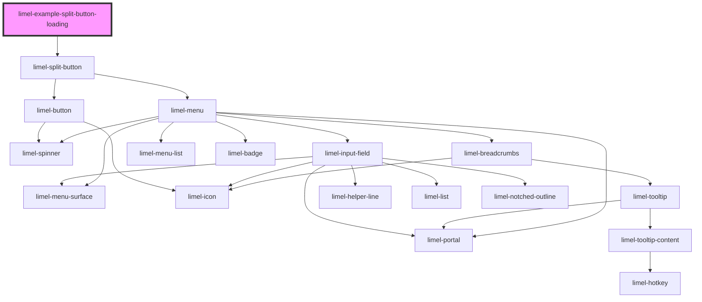

<!-- Auto Generated Below -->

## Overview

Split button with loading

## Dependencies

### Depends on

- [limel-split-button](..)

### Graph

----------------------------------------------

*Built with [StencilJS](https://stenciljs.com/)*
