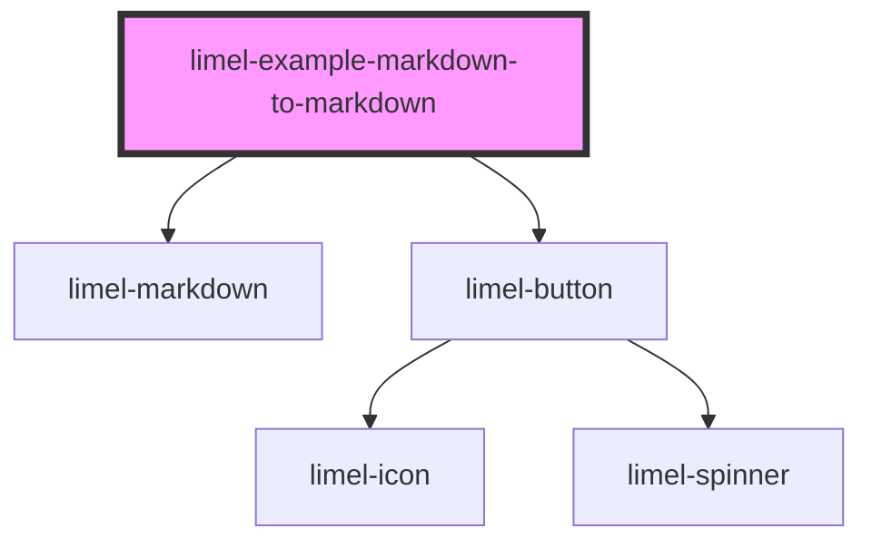

<!-- Auto Generated Below -->

## Overview

Getting the content as markdown

Custom elements in the markdown are rendered as components, but a
target that cannot render them — the clipboard, for one — needs plain
markdown. `toMarkdown()` returns the component's content with every
whitelisted element replaced by the markdown it stands for.

An element takes part by implementing `MarkdownRepresentable`: one
method, `toMarkdown()`, returning the markdown for that instance. The
chip below returns a link with the record's name. An element that does
not implement it contributes its text when written with a closing tag,
and nothing otherwise — the badge here becomes nothing.

:::note
Only whitelisted elements are asked, since they are the only custom
elements that render. Where each one was written comes from the
parser, so a tag inside a code span is text and is left as it is, and
an element written inside another one is covered by its parent.
:::

## Dependencies

### Depends on

- [limel-markdown](..)
- [limel-button](../../button)

### Graph

----------------------------------------------

*Built with [StencilJS](https://stenciljs.com/)*
