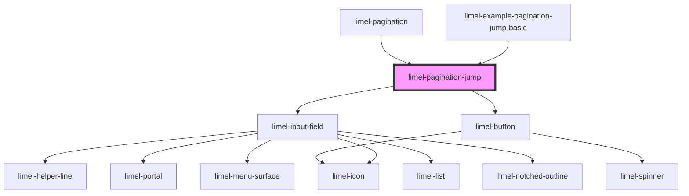

<!-- Auto Generated Below -->

## Overview

A field for going straight to a page, which `limel-pagination` puts inside
the popover its `···` opens.

It draws nothing until it is opened, so a pagination that is merely on
screen pays for an empty element rather than a form. It lives in a
component of its own because the popover carries its content into a shadow
root elsewhere on the page, where a parent's stylesheet cannot reach it —
a component brings its own.

## Properties

| Property    | Attribute    | Description                                                                                                                        | Type                                                                   | Default |
| ----------- | ------------ | ---------------------------------------------------------------------------------------------------------------------------------- | ---------------------------------------------------------------------- | ------- |
| `language`  | `language`   | The language used for the labels and for the way numbers are written.                                                              | `"da" \| "de" \| "en" \| "fi" \| "fr" \| "nb" \| "nl" \| "no" \| "sv"` | `'en'`  |
| `loading`   | `loading`    | Set while a page is being fetched, so that another cannot be asked for.                                                            | `boolean`                                                              | `false` |
| `open`      | `open`       | Whether the field is being shown.                                                                                                  | `boolean`                                                              | `false` |
| `page`      | `page`       | The page to start from, which is the one the user is on.                                                                           | `number`                                                               | `1`     |
| `pageCount` | `page-count` | How many pages there are, which is as far as a jump can go. `null` means the count has not arrived yet, and nothing caps the jump. | `number`                                                               | `1`     |

## Events

| Event  | Description                                                       | Type                  |
| ------ | ----------------------------------------------------------------- | --------------------- |
| `jump` | Asks for the page that was typed, already brought within the set. | `CustomEvent<number>` |

## Dependencies

### Used by

 - [limel-example-pagination-jump-basic](examples)
 - [limel-pagination](..)

### Depends on

- [limel-input-field](../../input-field)
- [limel-button](../../button)

### Graph

----------------------------------------------

*Built with [StencilJS](https://stenciljs.com/)*
