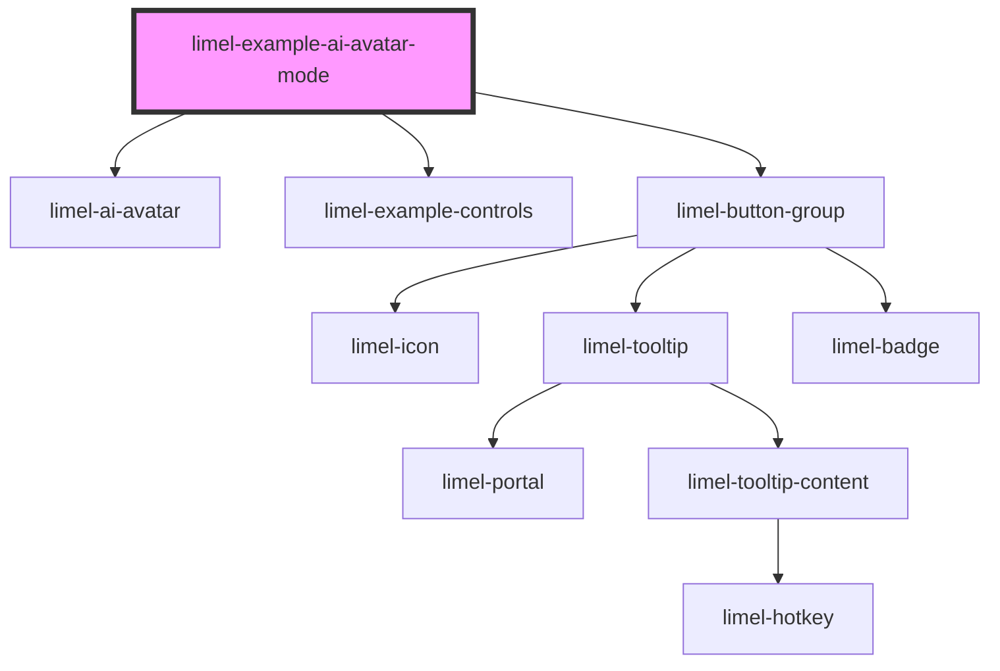

<!-- Auto Generated Below -->

## Overview

Modes

The `mode` property represents what the AI agent is currently doing. The
avatar's eyes, mouth, and any looping animations are driven by it. Modes
smoothly transition from one to another, so consumers can switch them at
any time as the agent's state changes.

Note that `mode` replaces the deprecated `isThinking` property. Setting
`isThinking` no longer has any visual effect; use `mode="thinking"`
instead.

Use the variant button-group to confirm that every mode's animations run
in every visual style — mode and variant are independent.

## Dependencies

### Depends on

- [limel-ai-avatar](..)
- [limel-example-controls](../../../examples)
- [limel-button-group](../../button-group)

### Graph

----------------------------------------------

*Built with [StencilJS](https://stenciljs.com/)*
