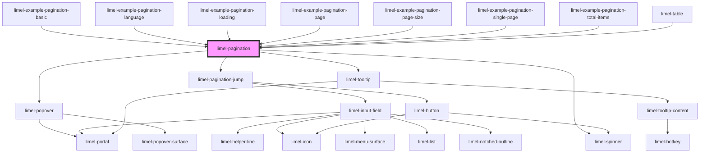

<!-- Auto Generated Below -->

## Overview

Pagination reports where the user is in a set of results, and allows them
to move somewhere else in it.
For a user, knowing where they are matters as much as being able to move.
A page number and a total tells users how much there is in the list that they are
looking at, and how far into it they have got; and hovering a page shows
exactly which items it holds.

Where there are more pages than fit, the ones left out are stood for by a
`···`. That is a button: it opens a field for going straight to any page in
the set, so no page is more than one move away however long the set is.

## Properties

| Property     | Attribute     | Description                                                                                                                                                                               | Type                                                                   | Default |
| ------------ | ------------- | ----------------------------------------------------------------------------------------------------------------------------------------------------------------------------------------- | ---------------------------------------------------------------------- | ------- |
| `language`   | `language`    | The language used for the labels and the tooltips, and for the way numbers are written.                                                                                                   | `"da" \| "de" \| "en" \| "fi" \| "fr" \| "nb" \| "nl" \| "no" \| "sv"` | `'en'`  |
| `loading`    | `loading`     | Set this to `true` while you are fetching a page.                                                                                                                                         | `boolean`                                                              | `false` |
| `page`       | `page`        | Which page to show. The first page is `1`, not `0`. Set it to the page from `goToPage` to move the control.                                                                               | `number`                                                               | `1`     |
| `pageSize`   | `page-size`   | Number of items that fit on one page. Together with `totalItems`, used by the component to calculate the total number of pages.                                                           | `number`                                                               | `100`   |
| `totalItems` | `total-items` | How many items there are in total, across every page. `null` means the count has not arrived yet. Together with `pageSize`, used by the component to calculate the total number of pages. | `number`                                                               | `null`  |

## Events

| Event      | Description                                                                                                                                                                                                                                                                                                                                                                                                                                                                                   | Type                         |
| ---------- | --------------------------------------------------------------------------------------------------------------------------------------------------------------------------------------------------------------------------------------------------------------------------------------------------------------------------------------------------------------------------------------------------------------------------------------------------------------------------------------------- | ---------------------------- |
| `goToPage` | Asks for a page to be loaded, and says which items it holds.  The component does not move itself. Clicking a page emits this and nothing else; set `page` to the number it carries and the control follows. Not setting it is how you decline — useful when the load fails, or when there is unsaved work to confirm first.  The one exception is a page that does not exist, which it cannot show whatever you say. There it shows the nearest page that does and emits so you can catch up. | `CustomEvent<GoToPageEvent>` |

## Dependencies

### Used by

 - [limel-example-pagination-basic](examples)
 - [limel-example-pagination-language](examples)
 - [limel-example-pagination-loading](examples)
 - [limel-example-pagination-page](examples)
 - [limel-example-pagination-page-size](examples)
 - [limel-example-pagination-single-page](examples)
 - [limel-example-pagination-total-items](examples)
 - [limel-table](../table)

### Depends on

- [limel-popover](../popover)
- [limel-pagination-jump](jump)
- [limel-spinner](../spinner)
- [limel-tooltip](../tooltip)

### Graph

----------------------------------------------

*Built with [StencilJS](https://stenciljs.com/)*
