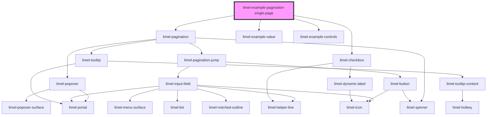

<!-- Auto Generated Below -->

## Overview

When there is only one page

The component always renders, even when everything fits on one page and
there is nowhere to go. If it hid itself, everything below it would jump up
the moment a filter happened to narrow the results, and you could not stop
that from happening. Whether to show a pagination at all is your decision,
so it is left to you.

With many pages, page 1 and the last page are always there, so both ends of
the list are one click away. That is why there are no separate first and
last buttons: the numbers already do that job, and they tell you where they
take you. The pages that do not fit are replaced by a `···`, which is a
button: it opens a field for going straight to any page in the set.

In this example, you can try narrowing the results and watch the control
shrink from 492 pages to one, without moving or disappearing.

## Dependencies

### Depends on

- [limel-pagination](..)
- [limel-example-value](../../../examples)
- [limel-example-controls](../../../examples)
- [limel-checkbox](../../checkbox)

### Graph

----------------------------------------------

*Built with [StencilJS](https://stenciljs.com/)*
