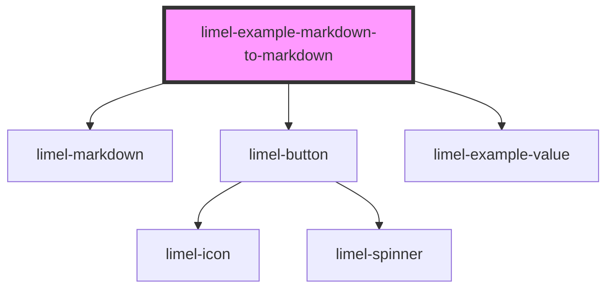

<!-- Auto Generated Below -->

## Overview

Exporting the content as markdown

`toMarkdown` returns the content as markdown, for targets that cannot
render custom elements, such as the clipboard. Each whitelisted element
that implements `MarkdownDescribable` is replaced by the markdown it
returns from its own `toMarkdown` method.

Here, the person chip describes itself as a `mailto:` link.

## Dependencies

### Depends on

- [limel-markdown](..)
- [limel-button](../../button)
- [limel-example-value](../../../examples)

### Graph

----------------------------------------------

*Built with [StencilJS](https://stenciljs.com/)*
