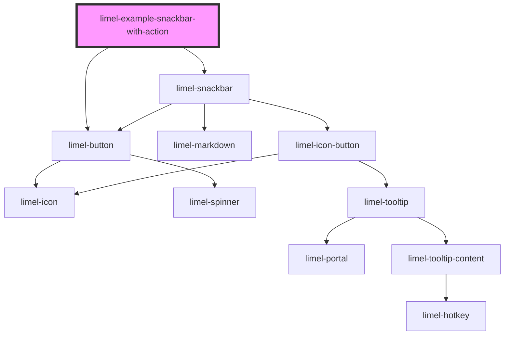

<!-- Auto Generated Below -->

## Overview

With actions
You can include a single action button inside the snackbar.

:::important
Keep in mind that pressing the action button will close
the snackbar immediately. The user must be informed that their
requested action actually took place. If there is no instant
visual feedback (for sighted users) in the user interface that
informs the user about the updated state, displaying another
snackbar could be a good idea.
:::

## Dependencies

### Depends on

- [limel-button](../../button)
- [limel-snackbar](..)

### Graph

----------------------------------------------

*Built with [StencilJS](https://stenciljs.com/)*
