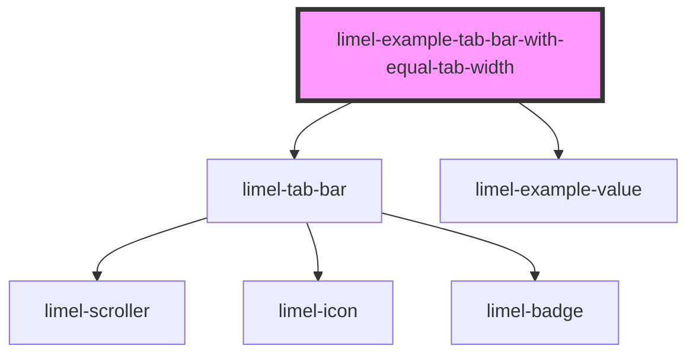

<!-- Auto Generated Below -->

## Overview

Tab bars with custom styles
In some situations and for the sake of UI design, you may want to have tabs
that equally share the available screen width and stretch. To get such a
result, you can add the `has-tabs-with-equal-width` class to the tab bar.

Unlike tabs that follow their content, tabs with equal width have no
largest width by default, so that they always fill the tab bar. If you set
`--tab-bar-horizontal-tab-max-width`, they stop growing at that width, and
in a wide tab bar, the space after the last tab stays empty.

## Dependencies

### Depends on

- [limel-tab-bar](..)
- [limel-example-value](../../../examples)

### Graph

----------------------------------------------

*Built with [StencilJS](https://stenciljs.com/)*
