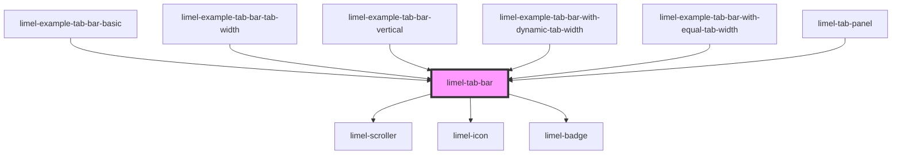

<!-- Auto Generated Below -->

## Overview

Tabs are great to organize information hierarchically in the interface and divide it into distinct categories. Using tabs, you can create groups of content that are related and at the same level in the hierarchy.
:::warning
Tab bars should be strictly used for navigation at the top levels.
They should never be used to perform actions, or navigate away from the view which contains them.
:::
An exception for using tab bars in a high level of hierarchy is their usage in modals. This is because modals are perceived as a separate place and not a part of the current context. Therefore you can use tab bars in a modal to group and organize its content.
A tab bar can contain an unlimited number of tabs. However, depending on the device width and width of the tabs, the number of tabs that are visible at the same time will vary. When there is limited horizontal space, the component shows a left-arrow and/or right-arrow button, which scrolls and reveals the additional tabs. The tab bar can also be swiped left and right on a touch-device. A vertical tab bar does the same, upwards and downwards.
The arrows are only a shortcut for people who use a mouse or a touch screen. Screen readers do not announce them, and the Tab key skips them. People who use a keyboard or a screen reader move between the tabs, and the tab bar keeps the selected tab in view.
The left and right arrow keys move to the previous and the next tab, and select it. In a vertical tab bar, the up and down arrow keys do that instead. Home and End move to the first and the last tab. Moving past the last tab continues at the first one, and the other way around. The Tab key moves on to what comes after the tab bar, and moving back with Shift and Tab lands on the selected tab, or on the first tab when none is selected.
:::tip Other things to consider
Never divide the content of a tab using a nested tab bar.
Never place two tab bars within the same screen.
Never use background color for icons in tabs.
Avoid having long labels for tabs.
A tab will never be removed or get disabled, even if there is no content under it.
:::

## Properties

| Property      | Attribute     | Description                                                                                           | Type                         | Default        |
| ------------- | ------------- | ----------------------------------------------------------------------------------------------------- | ---------------------------- | -------------- |
| `orientation` | `orientation` | Whether the tabs are laid out in a row, above the content they belong to, or in a column, next to it. | `"horizontal" \| "vertical"` | `'horizontal'` |
| `tabs`        | --            | List of tabs to display                                                                               | `Tab[]`                      | `[]`           |

## Events

| Event       | Description                         | Type               |
| ----------- | ----------------------------------- | ------------------ |
| `changeTab` | Emitted when a tab has been changed | `CustomEvent<Tab>` |

## Dependencies

### Used by

 - [limel-example-tab-bar-basic](examples)
 - [limel-example-tab-bar-tab-width](examples)
 - [limel-example-tab-bar-vertical](examples)
 - [limel-example-tab-bar-with-dynamic-tab-width](examples)
 - [limel-example-tab-bar-with-equal-tab-width](examples)
 - [limel-tab-panel](../tab-panel)

### Depends on

- [limel-scroller](../scroller)
- [limel-icon](../icon)
- [limel-badge](../badge)

### Graph

----------------------------------------------

*Built with [StencilJS](https://stenciljs.com/)*
