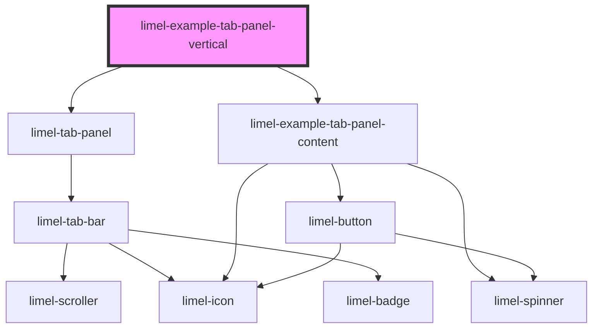

<!-- Auto Generated Below -->

## Overview

Vertical tab panel
Set `orientation` to `vertical` to place the tabs in a column, to the left
of the content. This suits a view with many sections, such as settings, in
a container that is wider than it is tall.

## Dependencies

### Depends on

- [limel-tab-panel](..)
- [limel-example-tab-panel-content](.)

### Graph

----------------------------------------------

*Built with [StencilJS](https://stenciljs.com/)*
