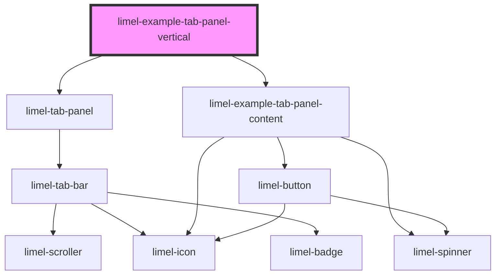

<!-- Auto Generated Below -->


## Overview

Vertical tab panel
Set `orientation` to `vertical` to place the tabs in a column, to the left
of the content. This suits a view with many sections, such as settings, in
a container that is wider than it is tall.

The column is `10rem` wide, whatever its labels, so that the content next
to it keeps its place when a label or a badge changes. Try the vote button:
the badge it adds takes room from the label, not from the content. Set
`--tab-bar-vertical-width` on the panel to change the width.

:::tip
Decide on the width once for the whole app, by setting it on `:root`, and
change it there in media queries for different screen sizes. A tab panel
that needs another width can still set its own.
```css
:root {
    --tab-bar-vertical-width: 12rem;
}

.settings limel-tab-panel {
    --tab-bar-vertical-width: 16rem;
}
```
:::

## Dependencies

### Depends on

- [limel-tab-panel](..)
- [limel-example-tab-panel-content](.)

### Graph


----------------------------------------------

*Built with [StencilJS](https://stenciljs.com/)*
